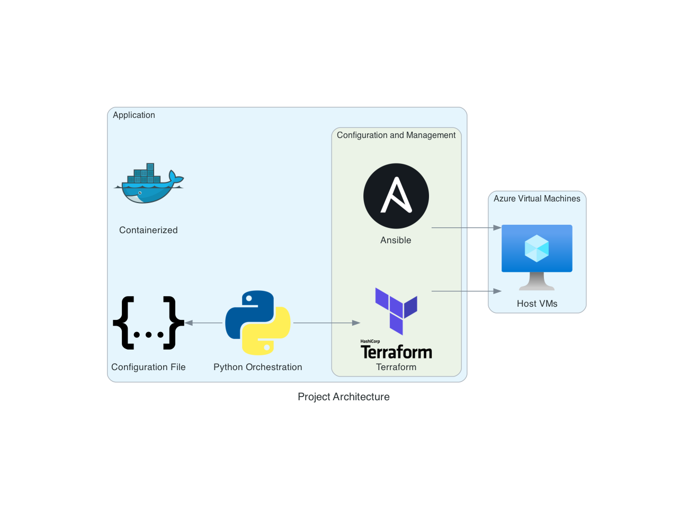

cloud-1
=======
### Automated deployment of a dockerized application on Azure.

The goal of this project is to automate the deployment of my Inception project, which is a dockerized Wordpress application (NGINX / PHP-fpm / MariaDB).

You can find more details about this project [here](https://github.com/HakimHC/inception).

Project Overview
================

This project aims to automate two things:
* (Optional) Create a Virtual Machine on Azure with Terraform.
* Deploy the Inception application on one or more servers.

Below you can see the architecture of the project.



The orchestration is performed by a Python script,
configured with a configuration file (```config.json```).<br>
This configuration file provides us with a flexible and extensible way
to configure our deployment.

The automation of this process is dockerized,
thus the only dependency of this project is ```docker``` and ```docker compose``` (and optionally your Azure Service Principal credentials).

See more about the configuration below.

Project setup
=============

First, you must enter your credentials and place them in a ```.env``` file.
An example is provided in the ```.env.example``` file. <br>
This process must be repeated with ```.env.inception```, for the credentials of the application to be deployed itself.

After completing these steps, you can perform the deployment with a simple <br>
```$ docker compose up --build```.

And that's it, as easy as that. <br>

Next, we'll cover the configuration of the program.

Example configuration:
======================

```json
{
  "logging": {
    "log_file": "./logs/test.log",
    "level": "debug",
    "format": "[%(asctime)s] - %(levelname)s - %(message)s"
  },

  "ansible": {
    "playbook_path": "./ansible/playbook.yml",
    "extra_vars": {
      "testing": "hola"
    }
    
  },

  "inventory": {
    "template_path": "./ansible/templates/inventory.j2",
    "inventory_path": "./ansible/inventory.ini",
    
    "hosts": [{
      "ip_address": "127.0.0.1",
      "user": "my_user"
    }]
  },

  "terraform": {
    "base_dir": "./terraform",
    "apply": false
  }
}
```


Configuration
=============

The configuration file is the core of this project,
it's in a JSON format and consists of the following blocks:

* Logging (Optional)
* Terraform (Optional)
* Ansible (Required)
* Inventory (Required)

## Terraform
### Required fields:

* ```base_dir```: Path to directory of the terraform config files.
* ```apply```: Boolean that indicates whether ```terraform apply``` should run or not.

### Optional fields: -

## Inventory
### Required fields:

* ```template_path```: Path to the Jinja2 template of the inventory.
* ```inventory_path```: Path where the output of the built template will be saved. This will be the inventory used by the Ansible Playbook.

### Optional fields:
* ```hosts```: Additional hosts to add to the inventory file. Must be a dictionary with the following fields: ```ip_address``` and ```user```.

## Ansible
### Required fields:

* ```playbook_path```: Path to the ansible playbook that will be executed.
 
### Optional fields:
* ```extra_vars```: Additional variables that you can pass to the playbook. Must be in a dictionary format.

## Logging
### Required fields: -
### Optional fields:
* ```log_file```: Path to the log file where the output will be saved. (Default: ```./deployment.log```)
* ```level```: Log level. (Default: ```INFO```)
* ```format```: Format of the output (Default: ```[%(asctime)s] - %(levelname)s - %(message)s```)

